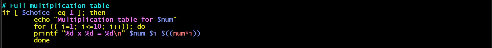
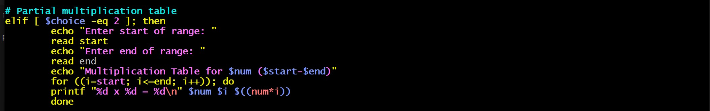
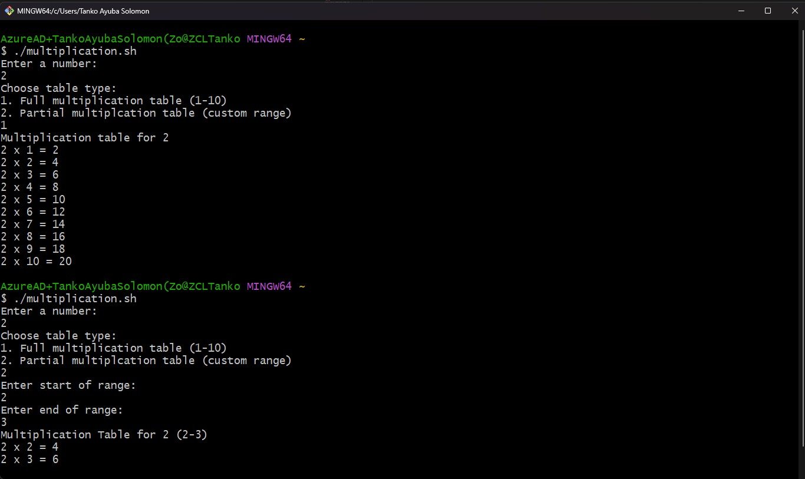

## Generate a Multiplication Table Using Bash Scripting

### 1.  Project Objective and Description

The created bash script will generate a multiplication table, and the script will prompt the user to enter a number and then ask if the user prefers to see a full multiplication table from 1 to 10 or a partial table within a specified range. Based on the choice, the script will display the corresponding multiplication table.

The first line in my bash script is the "shebang" (#!), and It tells the system which interpreter to use for the script. In this case, /bin/bash specifies that the script should run using the Bash shell, as seen below with the snapshot.

`#!/bin/bash`

### 2.  User to Enter a Number

Since the interpreter is established. I then use the echo command to print the message "Enter a number:" to prompt the user to enter a number. And
also, use the read command to take input from the user and store it in the variable num as shown in the snapshot and syntax below, and I also use "# Prompt user to enter a number" to pass a comment.

`echo "Enter a number: "`

`read num`

### 3.  Prompt User to Choose Table Type

For the user to choose a table type I use the echo prints instructions to ask the user to select a table type: either a full multiplication table (1 to 10) or a partial one with a custom range.
Read choice stores the user’s selection in the variable choice as shown on the syntax and snapshot below.

`echo "Choose table type:"`

`echo "1. Full multiplication table (1-10)"`

`echo "2. Partial multiplcation table (custom range)"`

`read choice`

### 4. Full Multiplication Table

I use the "if [ $choice -eq 1 ]" to check if the user chose option 1 (full multiplication table) and If the condition is true, it prints "Multiplication Table for $num" to indicate the start of the table.
I then use the for loop to iterate over the numbers 1 to 10 using (i=1; i<=10; i++), and for each iteration, printf prints a formatted line showing the multiplication of num by example. (5 x 1 = 5).

See the syntax and the snapshot used below to aid the understanding

`if [ $choice -eq 1 ]; then`

`echo "Multiplication Table for $num"`

`for ((i=1; i<=10; i++)); do`

`printf "%d x %d = %d\n" $num $i $((num*i))`

`done`

 

### 5.  Partial Multiplication Table

I use the "elif [ $choice -eq 2 ]" to check if the user chose option 2 (partial multiplication table), and If this condition is true, it prompts the user to enter a start and end range (read start and read end).
It prints the "Multiplication Table for $num" for the specified range ($start-$end).
The for loop then iterates from the starting value (start) to the ending value (end), calculating and printing each multiplication for the specified range.
See the syntax and the snapshot used below to aid the understanding.

`elif [ $choice -eq 2 ]; then`

`echo "Enter start of range: "`

`read start`
`echo "Enter end of range: "`

`read end`

`echo "Multiplication Table for $num ``($start-$end)"`

`for ((i=start; i<=end; i++)); do`

`printf "%d x %d = %d\n" $num $i $((num*i))`

`done`

### 6.  Invalid Choice
Finally, I then use the else block runs if neither choice 1 nor choice 2 is selected, meaning that the user made an invalid choice.
It prints "Invalid choice. Exiting." and then exits the script with a status of 1 (exit 1), indicating an error as seen in the syntax and the snapshot below.

`else`

`echo "Invalid choice. Exiting."`

`exit 1`

`fi`

### 7.  Summary

In conclusion, I tested the code by asking the user for a number and then asking the user if it wanted a full multiplication table (1 to 10) or a custom range. Depending on the choice, it prints the corresponding multiplication table or exits with an error if the option is invalid as shown in the outcome snapshot below.

This conclude the project work, and thanks.